* Table of Contents
{:toc}

--------------------------------------------------------------------------------------------------------------------

## **Setting up, getting started**

Refer to the guide [_Setting up and getting started_](SettingUp.md).

--------------------------------------------------------------------------------------------------------------------

## **Design**

### Architecture

The ***Architecture Diagram*** given above explains the high-level design of the App. Given below is a quick overview of each component.

:bulb: **Tip:** The `.puml` files used to create diagrams in this document can be found in the [diagrams](https://github.com/se-edu/addressbook-level3/tree/master/docs/diagrams/) folder. Refer to the [_PlantUML Tutorial_ at se-edu/guides](https://se-education.org/guides/tutorials/plantUml.html) to learn how to create and edit diagrams.

**`Main`** has two classes called [`Main`](https://github.com/se-edu/addressbook-level3/tree/master/src/main/java/seedu/address/Main.java) and [`MainApp`](https://github.com/se-edu/addressbook-level3/tree/master/src/main/java/seedu/address/MainApp.java). It is responsible for,
* At app launch: Initializes the components in the correct sequence, and connects them up with each other.
* At shut down: Shuts down the components and invokes cleanup methods where necessary.

[**`Commons`**](#common-classes) represents a collection of classes used by multiple other components.

The rest of the App consists of four components.

* [**`UI`**](#ui-component): The UI of the App.
* [**`Logic`**](#logic-component): The command executor.
* [**`Model`**](#model-component): Holds the data of the App in memory.
* [**`Storage`**](#storage-component): Reads data from, and writes data to, the hard disk.
* [**`Nusmods`**](#nusmods-component): Reads data from the NUSMODS public API.

Each of the four components,

* defines its *API* in an `interface` with the same name as the Component.
* exposes its functionality using a concrete `{Component Name}Manager` class (which implements the corresponding API `interface` mentioned in the previous point.

For example, the `Logic` component (see the class diagram given below) defines its API in the `Logic.java` interface and exposes its functionality using the `LogicManager.java` class which implements the `Logic` interface.

**How the architecture components interact with each other**

The *Sequence Diagram* below shows how the components interact with each other for the scenario where the user issues the command `delete 1`.

The sections below give more details of each component.

### UI component

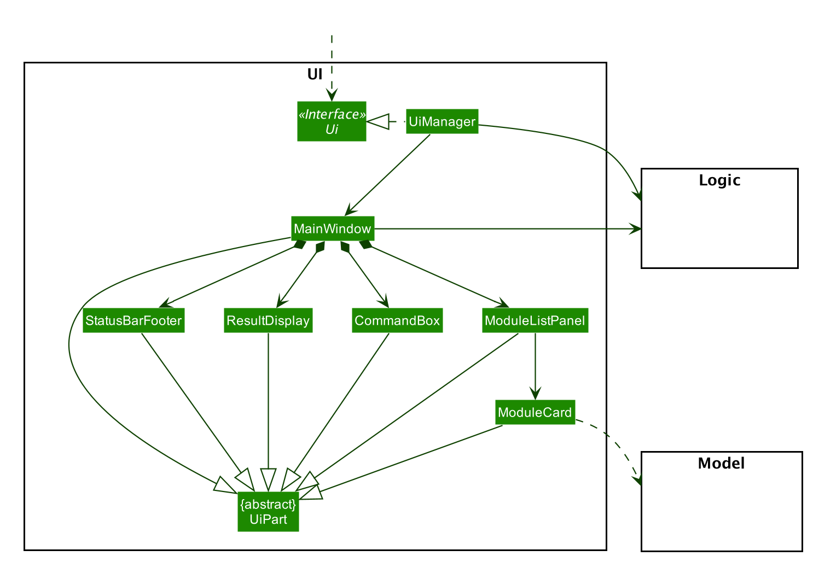

**API** :
[`Ui.java`](https://github.com/AY2021S1-CS2103T-T09-1/tp/blob/master/src/main/java/seedu/address/ui/Ui.java)

The UI consists of a `MainWindow` that is made up of parts e.g.`CommandBox`, `ResultDisplay`, `ModuleListPanel`, `StatusBarFooter` etc. All these, including the `MainWindow`, inherit from the abstract `UiPart` class.

The `UI` component uses JavaFx UI framework. The layout of these UI parts are defined in matching `.fxml` files that are in the `src/main/resources/view` folder. For example, the layout of the [`MainWindow`](https://github.com/AY2021S1-CS2103T-T09-1/tp/blob/master/src/main/java/seedu/address/ui/MainWindow.java) is specified in [`MainWindow.fxml`](https://github.com/AY2021S1-CS2103T-T09-1/tp/blob/master/src/main/resources/view/MainWindow.fxml)

The `UI` component,

* Executes user commands using the `Logic` component.
* Listens for changes to `Model` data so that the UI can be updated with the modified data.

### Logic component

**API** :
[`Logic.java`](https://github.com/se-edu/addressbook-level3/tree/master/src/main/java/seedu/address/logic/Logic.java)

1. `Logic` uses the `GradPadParser` class to parse the user command.
1. This results in a `Command` object which is executed by the `LogicManager`.
1. The command execution can affect the `Model` (e.g. adding a module).
1. The result of the command execution is encapsulated as a `CommandResult` object which is passed back to the `Ui`.
1. In addition, the `CommandResult` object can also instruct the `Ui` to perform certain actions, such as displaying help to the user.

Given below is the Sequence Diagram for interactions within the `Logic` component for the `execute("delete 1")` API call.

:information_source: **Note:** The lifeline for `DeleteCommandParser` should end at the destroy marker (X) but due to a limitation of PlantUML, the lifeline reaches the end of diagram.

### Model component

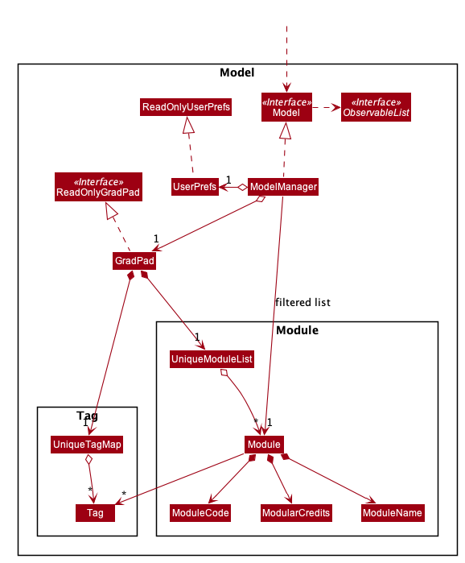

**API** : [`Model.java`](https://github.com/AY2021S1-CS2103T-T09-1/tp/blob/master/src/main/java/seedu/address/model/Model.java)

The `Model`,

* stores a `UserPref` object that represents the user’s preferences.
* stores the GradPad data.
* exposes an unmodifiable `ObservableList<Module>` that can be 'observed' e.g. the UI can be bound to this list so that the UI automatically updates when the data in the list change.
* does not depend on any of the other three components.

:information_source: **Note:** An alternative (arguably, a more OOP) model is given below. It has a `Tag` list in the `GradPad`, which `Module` references. This allows `GradPad` to only require one `Tag` object per unique `Tag`, instead of each `Module` needing their own `Tag` object. 
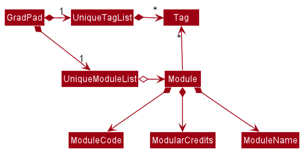

### Storage component

**API** : [`Storage.java`](https://github.com/se-edu/addressbook-level3/tree/master/src/main/java/seedu/address/storage/Storage.java)

The `Storage` component,
* can save `UserPref` objects in json format and read it back.
* can save the GradPad data in json format and read it back.

### Nusmods component

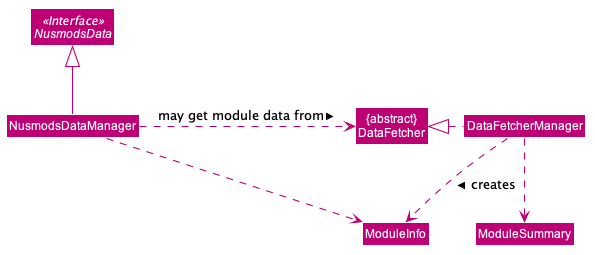

**API** : [`NusmodsData.java`](https://github.com/AY2021S1-CS2103T-T09-1/tp/blob/master/src/main/java/seedu/address/nusmods/NusmodsData.java)

The `Nusmods` component,
* can fetch module data from the NUSMODS public API.
* can save fetched module data in the form of `ModuleInfo` objects to a local JSON file.
* can provide module information based on a module code, in the form of `ModuleInfo` objects.

Critically, the component is able to fall back on reading pre-fetched module information from a local file when 
there's no internet connection.

#### Design considerations

We chose to split the `Nusmods` component into two main parts that have the following responsibilities respectively:
* Fetch module data - handled by `DataFetcher`
* Allow other GradPad components to access module data - handled by `NusmodsData`

##### Rationale

We chose to do this instead of clumping all the logic together to achieve better encapsulation and abstraction.
With this, the `NusmodsData` class only needs to be concerned with reading available module data, processing it,
and serving it up to the code who requested it. It doesn't need to care about how the data got there. 
That's the job of the `DataFetcher` class. As such, it is easy for us to swap out `DataFetcher`, or change its 
implementation without the need to touch the public interface provided by `NusmodsData`. This will prove to be 
useful when, for example, the NUSMODS API becomes obsolete, and we need to use another API, or if the NUSMODS 
API changes, and we need to redesign how we fetch data from it.

### Common classes

Classes used by multiple components are in the `seedu.addressbook.commons` package.

--------------------------------------------------------------------------------------------------------------------

## **Implementation**

This section describes some noteworthy details on how certain features are implemented.

### Add feature
GradPad allows users to add modules to their list.

The following fields of a module are required (* for optional):
* Module Code
* Modular Credits
* Tag*

As with all operations in GradPad, the `AddCommand` class handles the execution of add operations.
The `AddCommandParser` class helps to parse user's input before creating the correct add command.

Given below is how an add operation behaves at each step of its execution.

1. The user types in a command string corresponding to an add operation.

2. This calls the `execute` method of the `LogicManager` class. The user input is passed in as a string.

3. `Logic.execute()` then calls the `parseCommand` method of the `gradPadParser` class to parse the string input.

4. `gradPadParser.parseCommand()` sees that this is an add command, and so uses the `AddCommandParser`
class to create a corresponding `AddCommand`, using the `AddCommandParser.parse()` method.

5. In `AddCommandParser.parse()`, the string input is first split into tokens, i.e. new module code, new tags, etc.

6. Then, in the same method call, a new `Module` object is created from these tokens. It now stores
the values that we want to add into our list.

7. Lastly, in the same method call, an `AddCommand` is created with the new populated `Module`, and is passed back to the
`LogicManager` in step 2.

8. `Logic Manager` executes the newly created `AddCommand`.

9. Finally, the `Model` is then updated by adding the new `Module` object.

The following sequence diagram shows how the add command is executed.

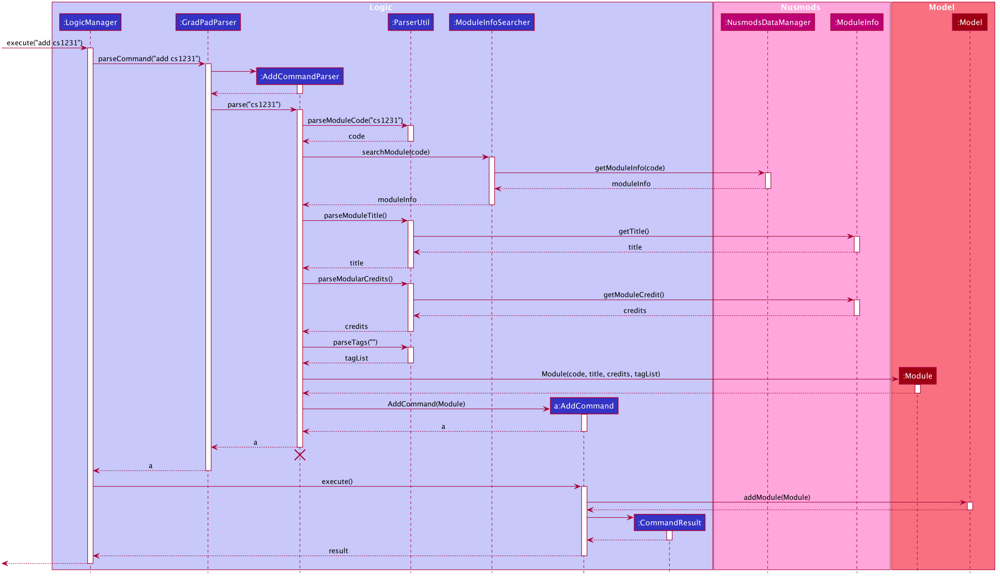

### Edit feature
GradPad allows users to edit modules that have already been added. 

The following fields of a module can be edited:
* Module Code
* Modular Credits
* Tags

As with all operations in GradPad, the `EditCommand` class handles the execution of edit operations.
The `EditCommandParser` class helps to parse a user's input before creating the correct edit command.

GradPad uses the `EditModuleDescriptor` class to facilitate edit operations. An `EditModuleDescriptor` is
a temporary bridge that holds the newly-edited fields of a module. You can set the `ModuleCode`,
`ModularCredit`, and `Tags` of an `EditModuleDescriptor`. It is also fine to omit any of them, which is important
as we don't want to be overly-concerned with which fields are to be edited and which are not.

Given below is how an edit operation behaves at each step of its execution.

1. The user types in a command string corresponding to an edit operation.

2. This calls the `execute` method of the `LogicManager` class. The user input is passed in as a string.

3. `Logic.execute()` then calls the `parseCommand`  method of the `gradPadParser` class to parse the string input.

4. `gradPadParser.parseCommand()` sees that this is an edit command, and so uses the `EditCommandParser`
class to create a corresponding `EditCommand`.

5. In `EditCommandParser`, the string input is first split into tokens, i.e. new module code, new tags, etc.

6. Then, in the same method call, an `EditModuleDescriptor` object is created from these tokens. It now stores
the new values that we want to update the target module with.

7. An `EditCommand` is then created with this populated `EditModuleDescriptor`, and is passed back to the
`LogicManager` in step 2.

8. `LogicManager` executes the newly created `EditCommand`.

9. The target module to be edited is retrieved. A copy of it is made and using the populated
 `EditModuleDescriptor`, the fields that are to be updated are replaced with their new values.
 
10. The `Model` is then updated by replacing the target module with its new updated copy.

The following sequence diagram shows how the edit command is executed.

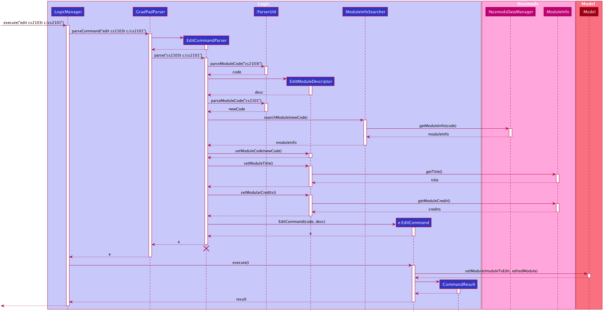

### Delete feature
GradPad allows users to delete modules that have already been added. 

As with all operations in GradPad, the `DeleteCommand` class handles the execution of delete operations.
The `DeleteCommandParser` class helps to parse a user's input before creating the correct delete command.

Given below is how a delete operation behaves at each step of its execution.

1. The user types in a command string corresponding to a delete operation.

2. This calls the `execute` method of the `LogicManager` class. The user input is passed in as a string.

3. `Logic.execute()` then calls the `parseCommand`  method of the `gradPadParser` class to parse the string input.

4. `gradPadParser.parseCommand()` sees that this is an delete command, and so uses the `DeleteCommandParser`
class to create a corresponding `DeleteCommand`, using the `DeleteCommandParser.parse()` method.

5. In `DeleteCommandParser`, the ModuleCode is first extracted from the string input. 

6. A `DeleteCommand` is then created with the ModuleCode, and is passed back to the
`LogicManager` in step 2.

7. `LogicManager` executes the newly created `DeleteCommand`.

8. The target module to be deleted is retrieved, if it exists in the Current Modules of GradPad. 
 
9. The `Model` is then updated by removing the target module.

The following sequence diagram shows how the delete command is executed.

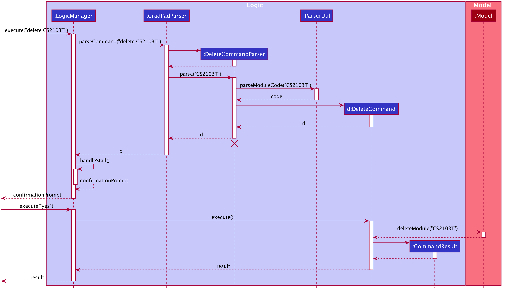

### Find feature
GradPad allows users to find a specific module to check if that module has been added. This feature is especially useful 
if there is a long list of modules currently in GradPad and users want to avoid the hassle of scrolling through the 
entire list to find the module they are looking for.  

As with all operations in GradPad, the `FindCommand` class handles the execution of find operations.
The `FindCommandParser` class helps to parse a user's input before creating the correct find command.

Given below is a series of steps to show how a find operation behaves during its execution.

1. The user types in a command string corresponding to a find operation, e.g. "find CS2103T".

2. This calls the `execute` method of the `LogicManager` class. The user input is passed in as a string.

3. `Logic.execute()` then calls the `parseCommand`  method of the `GradPadParser` class to parse the string input.

4. `GradPadParser.parseCommand()` identifies the command as a find command, and thus uses the `FindCommandParser`
class to extract the string input as a predicate and subsequently create a corresponding `FindCommand` with said predicate.

5. This `FindCommand` is then passed back to the`LogicManager` in step 2.

6. `LogicManager` executes the newly created `FindCommand`.

7. `FindCommand.execute()` calls for `Model` to filter the GradPad list based on the given predicate.

8. Finally, a `CommandResult` is created and returned to show the result of the execution.

The following sequence diagram illustrates how the find command is executed.

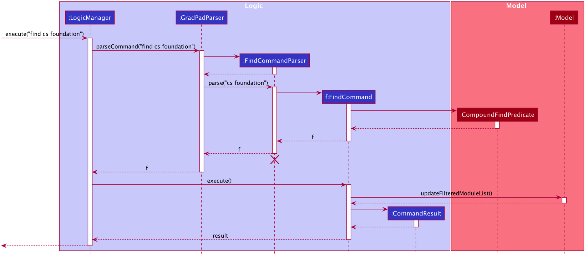

### List feature

The `list` command shows all modules that have been added by the user in the `Completed Modules` list.
This is needed as certain commands can change the modules that are being displayed. One such command is the
`find` command, which shows only matching modules in the list.

Before diving into how the `list` operation is executed, we must first gain a brief understanding of how the 
`Completed Modules` list displays its modules, and how this display can be changed by other commands.

The `Completed Modules` list is implemented by the `ModuleListPanel` UI class.
This class contains a list of modules, which comes from GradPad's `Model` component, that it uses to 
display to the user. To change the contents of the list, commands can apply filters to this list through `Model`.
For example, a module may ask `Model` to only show modules that have 4 modular credits.
When this happens, `Completed Modules` naturally changes the modules it displays too.

The following diagram illustrates this relationship:

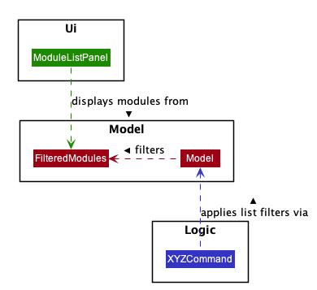

With this in mind, the aim of the `list` command is therefore to remove any existing filter on this module list,
effectively getting `Completed Modules` to display all modules once again.

Given below is a series of steps to show how a list operation behaves during its execution to achieve just this.

1. The user input is parsed and constructs a `ListCommand` object. (Implementation details of the parser are omitted
 here as they are not central in developing an understanding of the `list` operation)

2. When this command is executed, it calls the `updateFilteredModuleList` method in the `Model` class and passes in
a predicate that lets all modules through the filter.

3. The `Model` class updates its `filteredModules` list to include all modules as if it were unfiltered.

4. The `ModuleListPanel` UI component listens to changes in `filteredModules` and updates whenever the list is updated.
It thus updates to display all modules too.

The following sequence diagram illustrates how the list command is executed.

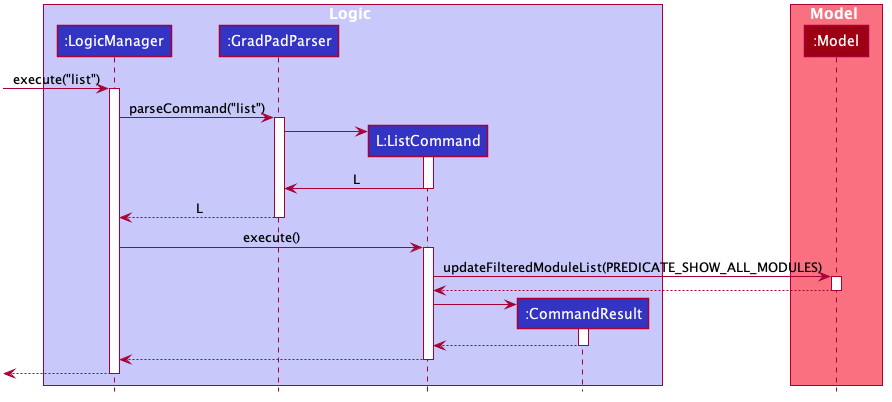

### CheckMc feature

The `checkmc` command allows users to view a tally of the total no. of modular credits from the modules present 
in the `Completed Modules` list.

As with all operations in GradPad, the `CheckMcCommand` class handles the execution of `checkmc` operations.
In brief, it works by going through all modules in the `Completed Modules` list and summing up each module's
modular credits.

Given below is a series of steps to show how a `checkmc` operation behaves during its execution.

1. The user enters the `checkmc` command string.

2. This calls the `execute` method of the `LogicManager` class with the user input passed in as a string.

3. `Logic.execute()` then calls the `parseCommand`  method of the `GradPadParser` class to parse the string input.

4. `GradPadParser.parseCommand()` identifies the command as a checkmc command and thus creates a `CheckMcCommand`
object.

5. This command object is then passed back to the `LogicManager` in step 2.

6. `LogicManager` executes the newly created `CheckMcCommand`.

7. `CheckMcCommand.execute()` retrieves the `GradPad` object stored within `Model` and accesses the `modules` field
within the `GradPad`.

8. It then loops through `modules`, which is a list of `Module` objects, and sums up all their modular credits.

8. Finally, a `CommandResult` is created to show the total no. of modular credits calculated.

The following sequence diagram illustrates how the `checkmc` command is executed.

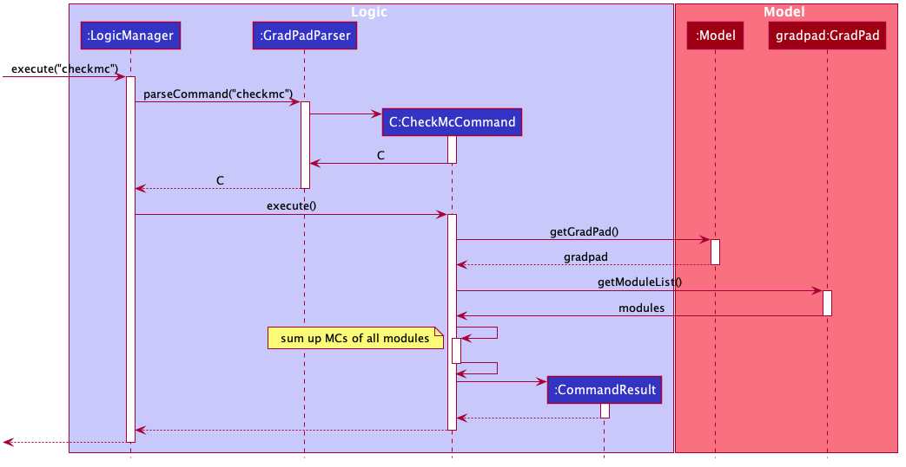

### [Implementation in progress] Check required modules feature

The `required` command allows users to view the required modules in the NUS Computer Science curriculum 
that they have yet to take.

When the command is executed, it checks through the current modules in the `Completed Modules` list and ensures
that modules that have already been taken are not displayed in the list of remaining required modules.

As with all operations in GradPad, the `RequiredCommand` class handles the execution of `required` operations.

Given below is a series of steps to show how a `required` operation behaves during its execution.

1. The user enters the `required` command string.

2. This calls the `execute` method of the `LogicManager` class with the user input passed in as a string.

3. `Logic.execute()` then calls the `parseCommand`  method of the `GradPadParser` class to parse the string input.

4. `GradPadParser.parseCommand()` identifies the command as a required command and thus creates a `RequiredCommand`
object.

5. This command object is then passed back to the `LogicManager` in step 2.

6. `LogicManager` executes the newly created `RequiredCommand`, which contains a hard-coded list of required modules
in the syllabus.

7. Then, `RequiredCommand.execute()` retrieves the `GradPad` object stored within `Model` and accesses the `modules
` field within the `GradPad`.

8. It filters the list of required modules by removing those that are present in `modules`.

9. Finally, a `CommandResult` is created to show the filtered list of remaining required modules.

### [Implementation in progress] Search all modules feature

The `search` command allows users to search for any module within the NUS Computer Science curriculum and view
its module details.

To retrieve a module's information, the execution of this command interacts with the `Nusmods` component, which
contains all logic related to the access of module data from the NUSMODS public API. We will not go into detail
about the component here as we are mainly focused on the implementation of the search functionality.

As with all operations in GradPad, the `SearchCommand` class handles the execution of `search` operations.

Given below is a series of steps to show how a `search` operation behaves during its execution.

1. The user enters a search command string containing a module code, e.g. "search CS2103T".

2. This calls the `execute` method of the `LogicManager` class with the user input passed in as a string.

3. `Logic.execute()` then calls the `parseCommand`  method of the `GradPadParser` class to parse the string input.

4. `GradPadParser.parseCommand()` identifies the command as a search command and thus creates a `SearchCommand`
object.

5. This command object is then passed back to the `LogicManager` in step 2.

6. `LogicManager` executes the newly created `SearchCommand`.

7. `SearchCommand.execute()` retrieves the corresponding module information by calling 
`NusmodsData.getModuleInfo()` in the `Nusmods` package.

9. Finally, a `CommandResult` is created to display the module information that has been retrieved.

### \[Proposed\] Undo/redo feature

#### Proposed Implementation

The proposed undo/redo mechanism is facilitated by `VersionedAddressBook`. It extends `AddressBook` with an undo/redo history, stored internally as an `addressBookStateList` and `currentStatePointer`. Additionally, it implements the following operations:

* `VersionedAddressBook#commit()` — Saves the current address book state in its history.
* `VersionedAddressBook#undo()` — Restores the previous address book state from its history.
* `VersionedAddressBook#redo()` — Restores a previously undone address book state from its history.

These operations are exposed in the `Model` interface as `Model#commitAddressBook()`, `Model#undoAddressBook()` and `Model#redoAddressBook()` respectively.

Given below is an example usage scenario and how the undo/redo mechanism behaves at each step.

Step 1. The user launches the application for the first time. The `VersionedAddressBook` will be initialized with the initial address book state, and the `currentStatePointer` pointing to that single address book state.

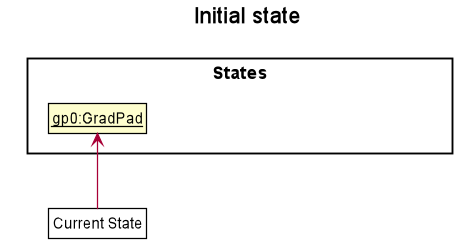

Step 2. The user executes `delete 5` command to delete the 5th person in the address book. The `delete` command calls `Model#commitAddressBook()`, causing the modified state of the address book after the `delete 5` command executes to be saved in the `addressBookStateList`, and the `currentStatePointer` is shifted to the newly inserted address book state.

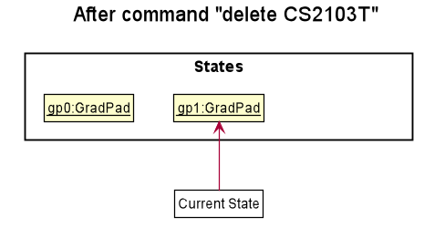

Step 3. The user executes `add n/David …​` to add a new person. The `add` command also calls `Model#commitAddressBook()`, causing another modified address book state to be saved into the `addressBookStateList`.

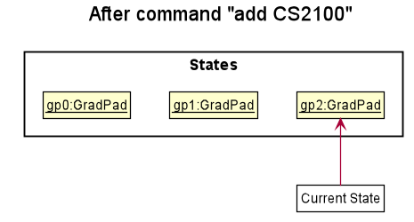

:information_source: **Note:** If a command fails its execution, it will not call `Model#commitAddressBook()`, so the address book state will not be saved into the `addressBookStateList`.

Step 4. The user now decides that adding the person was a mistake, and decides to undo that action by executing the `undo` command. The `undo` command will call `Model#undoAddressBook()`, which will shift the `currentStatePointer` once to the left, pointing it to the previous address book state, and restores the address book to that state.

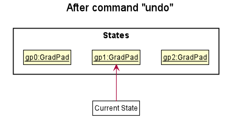

:information_source: **Note:** If the `currentStatePointer` is at index 0, pointing to the initial AddressBook state, then there are no previous AddressBook states to restore. The `undo` command uses `Model#canUndoAddressBook()` to check if this is the case. If so, it will return an error to the user rather
than attempting to perform the undo.

The following sequence diagram shows how the undo operation works:

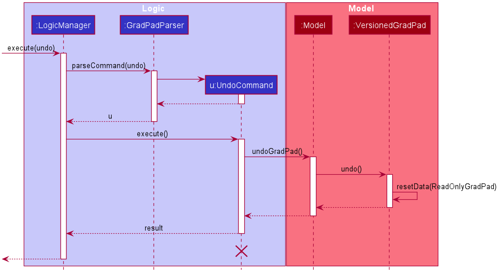

:information_source: **Note:** The lifeline for `UndoCommand` should end at the destroy marker (X) but due to a limitation of PlantUML, the lifeline reaches the end of diagram.

The `redo` command does the opposite — it calls `Model#redoAddressBook()`, which shifts the `currentStatePointer` once to the right, pointing to the previously undone state, and restores the address book to that state.

:information_source: **Note:** If the `currentStatePointer` is at index `addressBookStateList.size() - 1`, pointing to the latest address book state, then there are no undone AddressBook states to restore. The `redo` command uses `Model#canRedoAddressBook()` to check if this is the case. If so, it will return an error to the user rather than attempting to perform the redo.

Step 5. The user then decides to execute the command `list`. Commands that do not modify the address book, such as `list`, will usually not call `Model#commitAddressBook()`, `Model#undoAddressBook()` or `Model#redoAddressBook()`. Thus, the `addressBookStateList` remains unchanged.

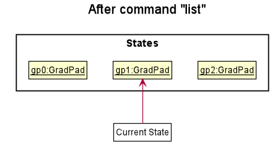

Step 6. The user executes `clear`, which calls `Model#commitAddressBook()`. Since the `currentStatePointer` is not pointing at the end of the `addressBookStateList`, all address book states after the `currentStatePointer` will be purged. Reason: It no longer makes sense to redo the `add n/David …​` command. This is the behavior that most modern desktop applications follow.

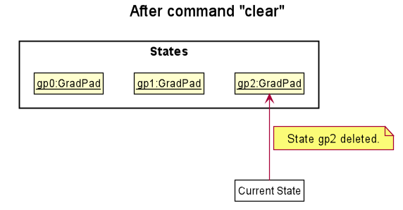

The following activity diagram summarizes what happens when a user executes a new command:

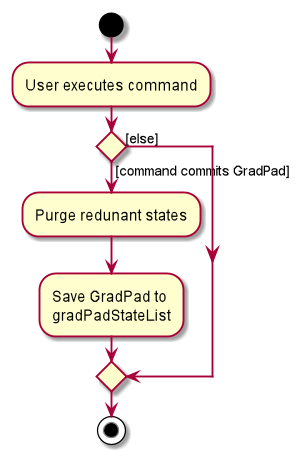

#### Design consideration:

##### Aspect: How undo & redo executes

* **Alternative 1 (current choice):** Saves the entire address book.
  * Pros: Easy to implement.
  * Cons: May have performance issues in terms of memory usage.

* **Alternative 2:** Individual command knows how to undo/redo by
  itself.
  * Pros: Will use less memory (e.g. for `delete`, just save the person being deleted).
  * Cons: We must ensure that the implementation of each individual command are correct.

_{more aspects and alternatives to be added}_

### \[Proposed\] Data archiving

_{Explain here how the data archiving feature will be implemented}_

--------------------------------------------------------------------------------------------------------------------

## **Documentation, logging, testing, configuration, dev-ops**

* [Documentation guide](Documentation.md)
* [Testing guide](Testing.md)
* [Logging guide](Logging.md)
* [Configuration guide](Configuration.md)
* [DevOps guide](DevOps.md)

--------------------------------------------------------------------------------------------------------------------

## **Appendix: Requirements**

### Product scope

**Target user profile**:

Anybody → Students → University Students → tech savvy University student → Computer Science students
NUS Computer Science undergraduate students, who wish to keep track of their necessary modules (how many are done, how many are left), and also the total MCs tabulation.

**Value proposition**: 

Keep track of your degree progress and modules taken during your time in NUS with ease. Faster and more lightweight than traditional GUI applications, view and update your progress by issuing simple text commands. Modules are conveniently categorized into their respective groupings e.g. Unrestricted Electives, Computer Science Foundations, etc.

### User stories

Priorities: High (must have) - `* * *`, Medium (nice to have) - `* *`, Low (unlikely to have) - `*`

| Priority | As a …​                                    | I want to …​                     | So that I can…​                                                        |
| -------- | ------------------------------------------ | ------------------------------ | ---------------------------------------------------------------------- |
| `* * *`  | NUS Student                                | see my total Modular Credits   | know how many more I require to graduate                 |
| `* * *`  | NUS Student                                | see my past Modules            | know what I have taken before                                                                   |
| `* * *`  | user                                       | delete modules                 | remove entries that I no longer need                                 |
| `* * *`  | user                                       | add modules and MCs            | keep track of my Modular progress |
| `* *`    | first-time user                            | access the available commands  | use the app efficiently                |
| `* *`    | user                                     | save and load my Module data   | keep track of my Modular progress                                            |

*{More to be added}*

### Use cases

(For all use cases below, the **System** is the `GradPad` and the **Actor** is the `user`, unless specified otherwise)

**Use case: Delete a Module**

**MSS**

1.  User requests to list Modules
2.  GradPad shows a list of Modules
3.  User requests to delete a specific Module in the list
4.  GradPad deletes the Module

    Use case ends.

**Extensions**

* 2a. The list is empty.

  Use case ends.

* 3a. The given index is invalid.

    * 3a1. GradPad shows an error message.

      Use case resumes at step 2.
      
**Use case : Add a Module**

**MSS**

1. User requests to list Modules
2. GradPad shows a list of Modules
3. User requests to add a specific Module into the list
4. GradPad adds the module

    Use case ends.
    
**Extensions**
  
* 3a. The given module is invalid.

    * 3a1. GradPad shows an error message.
    
      Use case resumes at step 2.
      
**Use case : View help**

**MSS**

1. User requests to view help commands
2. GradPad shows a list of commands

    Use case ends.
    
**Use case : view modules**

**MSS**

1. User requests to view current list of Modules
2. GradPad shows current list of Modules

    Use case ends.
    
**Use case : exit GradPad**

**MSS**

1. User requests to exit GradPad
2. GradPad exits

    Use case ends.

*{More to be added}*

### Non-Functional Requirements

1.  Should work on any _mainstream OS_ as long as it has Java `11` or above installed.
2.  Should work on both 32-bit and 64-bit environments.
3.  Should be backwards compatible with data produced by earlier versions of the application.
4.  Should be able to hold up to 1000 modules without a noticeable sluggishness in performance for typical usage.
5.  A user with above average typing speed for regular English text (i.e. not code, not system admin commands) should be able to accomplish most of the tasks faster using commands than using the mouse.
6.  Should be able to respond within one seconds.
7.  Should be usable by a novice who has never done module tracking of any sort.
8.  The application is not required to handle module tracking by NUS students outside of the Computer Science major. 

*{More to be added}*

### Glossary

* **Mainstream OS**: Windows, Linux, Unix, OS-X
* **Module Code**: Each module of study has a unique module code consisting of a two- or three-letter prefix that generally denotes the discipline, and four digits.
   * **First digit**: Represents the level of the module, i.e., 1000 indicates a Level 1 module and 2000, a Level 2 module, etc.
   * **Second digit**: Indicates the type of module, i.e., 1 for essential, 2 for elective, 3 for enrichment.
* **Modular Credit (MC)**: A unit of the effort, stated in terms of time, expected of a typical student in managing his/her workload. The MC-value of a module is derived by dividing the estimated total number of workload hours per week for that module by the credit factor of 2.5 (i.e., one MC is equivalent to 2.5 hours of study and preparation per week).

*{More to be added}*

--------------------------------------------------------------------------------------------------------------------

## **Appendix: Instructions for manual testing**

Given below are instructions to test the app manually.

:information_source: **Note:** These instructions only provide a starting point for testers to work on;
testers are expected to do more *exploratory* testing.

### Launch and shutdown

1. Initial launch

   1. Download the jar file and copy into an empty folder

   1. Double-click the jar file Expected: Shows the GUI with a set of sample contacts. The window size may not be optimum.

1. Saving window preferences

   1. Resize the window to an optimum size. Move the window to a different location. Close the window.

   1. Re-launch the app by double-clicking the jar file. 
       Expected: The most recent window size and location is retained.

1. _{ more test cases …​ }_

### Deleting a module

1. Deleting a module.

   1. Prerequisites: Multiple modules in the 'Current Modules'. e.g. CS2103T in 'Current Modules'.

   1. Test case: `delete CS2103T` 
      Expected: CS2103T module is deleted from 'Current Modules'. Details of the deleted module shown in the status message.

   1. Test case: `delete AA1000` 
      Expected: No module is deleted. Error details shown in the status message.

   1. Other incorrect delete commands to try: `delete`, `delete x`, `...`  
      Expected: Similar to previous.

1. _{ more test cases …​ }_

### Saving data

1. Dealing with missing/corrupted data files

   1. _{explain how to simulate a missing/corrupted file, and the expected behavior}_

1. _{ more test cases …​ }_
